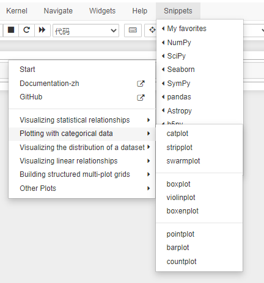
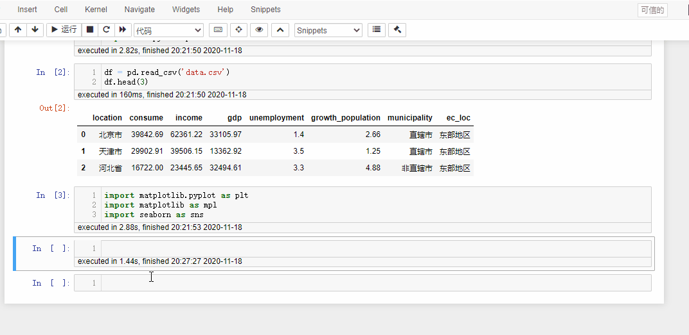
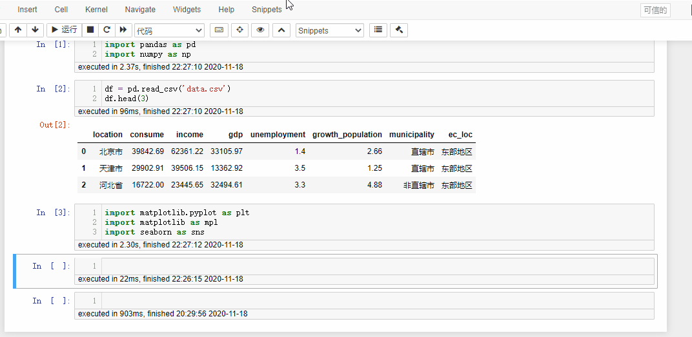
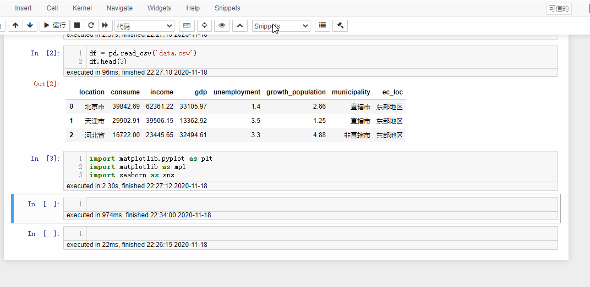

# JupyterBotebook_snippets_menu_Seaborn

## 介绍

在JupyterBotebook中通过snippets menu插入Seaborn代码，快速方便进行数据可视化。

snippets menu是一个在JupyterBotebook中插入常用代码的插件，方便快捷，详见https://jupyter-contrib-nbextensions.readthedocs.io/en/latest/nbextensions/snippets_menu/readme.html

参考ApacheCN的seaborn 0.9中文文档https://seaborn.apachecn.org/进行编写，基本包括所有的seaborn图形以及常用参数及参数说明。

注：参数说明是用英文写的，但是很好理解。有不明白的地方，对照文档看一下即可。

## 使用

将下载的`matplotlib.js`文件复制到路径`D:\Anaconda3\share\jupyter\nbextensions\snippets_menu\snippets_submenus_python`下覆盖原文件即可。你的路径可能会有些许差异。

原来的`matplotlib.js`是用来插入matplotlib常用代码，比较少，我就修改了它。可以备份一份原始的`matplotlib.js`文件。

## 演示

## 感谢

感谢ApacheCN对文档的翻译！
---

欢迎大家关注我的公众号：沙克芬 SharkFin

网站：[sharkfin.top](http://sharkfin.top)

语雀：[沙克芬——全学科网站导航](https://www.yuque.com/alipayqgthu1irbf/sharkfin)

知识星球：[沙克芬_稀有优质资源分享](https://t.zsxq.com/MJiIayN)

---

# JupyterBotebook_snippets_menu_Seaborn

## Introduction

Quickly and easily visualize data in JupyterBotebook by inserting Seaborn code through the snippets menu.

The snippets menu is a convenient plug-in for inserting frequently used codes into JupyterBotebook. Click it https://jupyter-contrib-nbextensions.readthedocs.io/en/latest/nbextensions/snippets_menu/readme.html

Refer to ApacheCN's seaborn 0.9 Chinese documentation. Click it https://seaborn.apachecn.org/    It basically includes all Seaborn graphs, common parameters and parameter descriptions.

Note: the parameter specification is written in English, but it is easy to understand. If you don't understand, please refer to the document.

## Use

Copy the downloaded`matplotlib.js`file to path `D:\Anaconda3\share\jupyter\nbextensions\snippets_menu\snippets_submenus_python`and overwrite the original file. Your path may be a little different.

The original `matplotlib.js` is used to insert common matplotlib code, which is not enough, so I modified it. You can make a backup copy of the original `matplotlib.js` file.

## Examples

## Thanks

Thanks to ApacheCN for translating the document!
